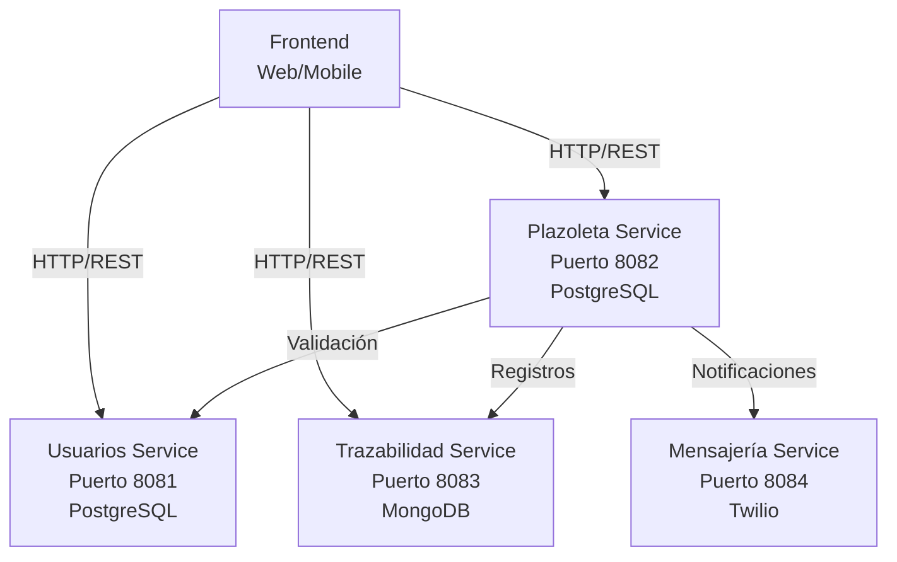

# Plazoleta de Comidas - Backend Microservicios

Sistema de gestión centralizado de pedidos para una plazoleta de comidas con múltiples restaurantes.

## Descripción General

Plataforma que permite a clientes realizar pedidos en diferentes restaurantes, a propietarios gestionar sus establecimientos y menús, y a empleados procesar pedidos en tiempo real. El sistema registra la trazabilidad de cada pedido y notifica a los clientes mediante SMS.

## Arquitectura



## Componentes

| Servicio | Descripción | Base de Datos | Puerto |
|----------|-------------|---|---|
| **usuarios-service** | Gestión de usuarios, roles y autenticación | PostgreSQL 16 | 8081 |
| **plazoleta-service** | Gestión de restaurantes, platos y pedidos | PostgreSQL 16 | 8082 |
| **trazabilidad-service** | Registro de cambios de estado de pedidos | MongoDB 5.0+ | 8083 |
| **mensajeria-service** | Envío de notificaciones SMS | Twilio | 8084 |

## Requisitos Previos

- Java 21
- Spring Boot 4.0.0
- Docker y Docker Compose
- PostgreSQL 16
- MongoDB 5.0+

## Inicio Rápido

### 1. Clonar repositorio raíz con submódulos

```bash
# Clonar el repositorio raíz con todos los submódulos
git clone --recurse-submodules https://github.com/Nekstoreo/plazoleta-microservicios.git
cd plazoleta-microservicios
```

Si ya clonó sin submódulos:
```bash
git submodule update --init --recursive
```

**Usar rama/tag específico en submódulos** (opcional):
```bash
# Usar un tag específico (ej. v1.0.0) en todos los servicios
./init-submodules.sh v1.0.0

# O manualmente para un servicio específico
cd usuarios-service
git checkout v1.0.0
cd ..
```

### 2. Configurar variables de entorno

```bash
cp .env.example .env
# Editar .env con tus credenciales
```

### 3. Levantar infraestructura

```bash
docker-compose up -d
```

Esto inicia:
- PostgreSQL (puertos 5432, 5433)
- MongoDB (puerto 27017)

### 3. Compilar y ejecutar servicios

```bash
# Cada microservicio
cd <service-directory>
./gradlew bootRun
```

O construir imágenes Docker:

```bash
./gradlew bootBuildImage
docker run -p <puerto>:<puerto> <service-image>
```

## Verificación

Una vez todos los servicios están en ejecución:

- **Usuarios**: http://localhost:8081/swagger-ui.html
- **Plazoleta**: http://localhost:8082/swagger-ui.html
- **Trazabilidad**: http://localhost:8083/swagger-ui.html
- **Mensajería**: http://localhost:8084/swagger-ui.html

## Documentación de Servicios

Cada microservicio implementa **Arquitectura Hexagonal** con separación clara entre dominio, aplicación e infraestructura.

- **[Usuarios Service](./usuarios-service/README.md)** - Gestión de roles y autenticación JWT
- **[Plazoleta Service](./plazoleta-service/README.md)** - Orquestación de restaurantes y pedidos
- **[Trazabilidad Service](./trazabilidad-service/README.md)** - Métricas y análisis de eficiencia
- **[Mensajería Service](./mensajeria-service/README.md)** - Notificaciones SMS

Para detalles técnicos profundos de cada servicio, consulte la documentación técnica en el directorio de cada microservicio.

## Flujo de Pedidos

1. **PENDIENTE**: Cliente realiza un nuevo pedido
2. **EN_PREPARACIÓN**: Empleado acepta y comienza a preparar
3. **LISTO**: Empleado marca como listo, cliente recibe PIN por SMS
4. **ENTREGADO**: Cliente entrega PIN y recibe su pedido
5. **CANCELADO**: Cliente puede cancelar desde estado PENDIENTE

## Notas de Desarrollo

- Cada servicio es un submódulo Git independiente bajo control de versiones
- Los submódulos permiten clonar todos los servicios de una vez con `--recurse-submodules`
- Usar `git submodule update` para sincronizar cambios en submódulos
- Los tags en los repositorios permiten fijar versiones específicas de cada servicio
- Cada servicio es independiente y se puede desplegar de forma aislada
- La comunicación entre servicios se realiza mediante llamadas REST sincrónicas (OpenFeign)
- Todos los servicios utilizan JWT para autenticación
- Swagger/OpenAPI está habilitado en cada servicio para documentación de endpoints

## Soporte

Para problemas o preguntas específicas de cada microservicio, consulte el README individual en su directorio correspondiente.
